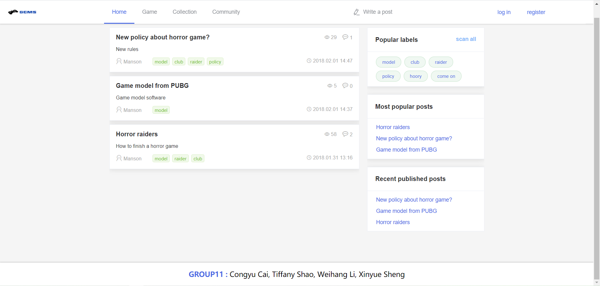
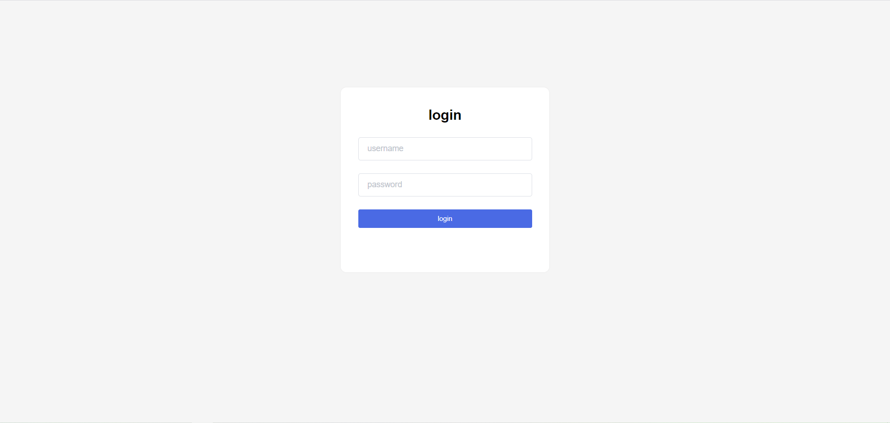
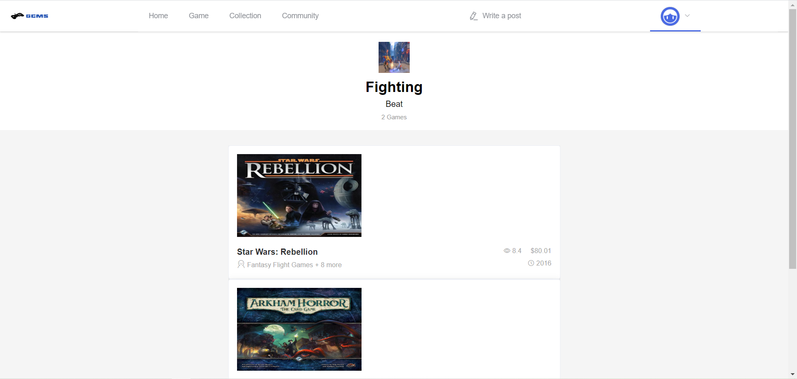
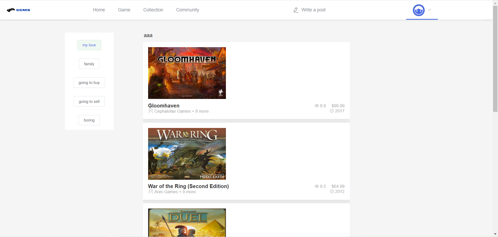
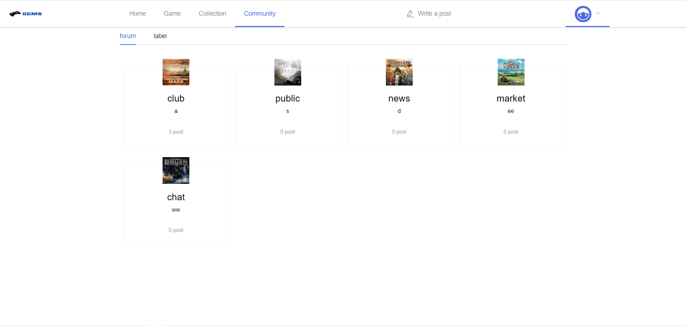
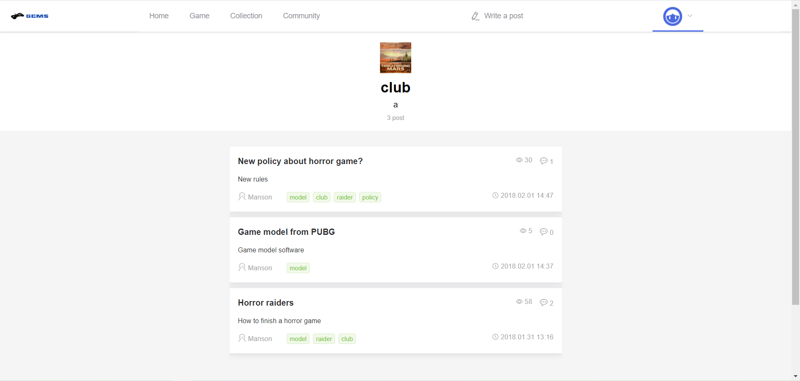
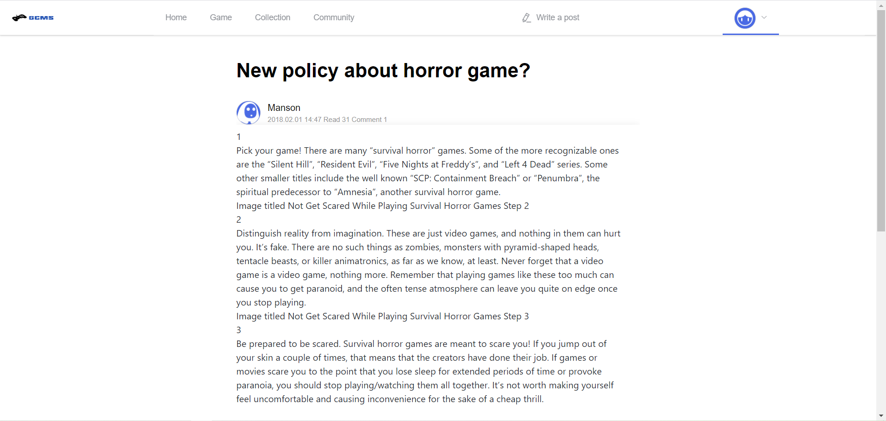
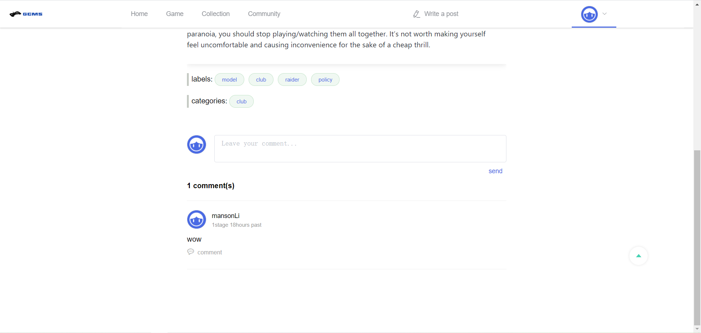
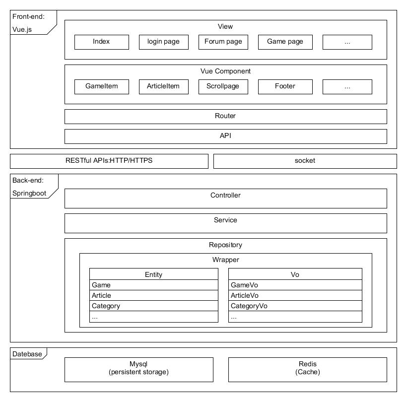

# Game Management System
* Springboot + Vue.js
* Github：https://github.com/mansonliwh/GameManagementSystem
* Designed by group11, members: Congyu Cai, Xi Shao, Weihang Li, Xinyue Sheng 

# Requirements
* Redis-3.2.1
* mysql-8.0.15
* Java version 1.8
* IDE

# User interface diagram
## Home page

## Login page

## Game category page

## Divided game list page

## Collection page

## Article category page

## Divided article list page

## Article view page

# System architecture

# Run this website in back end
0. connect the mysql
1. remodify ./blog-api/src/main/resources/application.properties to adapt the database option, then use ../sql/blog.sql to create the database
2. connect the redis
3. use any IDE to run ./blog-api/src/main/java/com/shimh/BlogApiApplication.java to activate the back-end
4. open url: http://localhost:8888

# Run this website in front-end dev-environment for all details
(Since all of the images only saved in the static path in the front end)
0. cd blog-app
1. npm install
2. npm run dev
3. open url: http://localhost:8080

## front-end blog-app
Vue
Vue-router
Vuex
ElementUI
mavon-editor
lodash
axios
Webpack
## back-end blog-api
SpringBoot
Shiro
Jpa
Redis
Fastjson
Druid
MySQL
Maven
